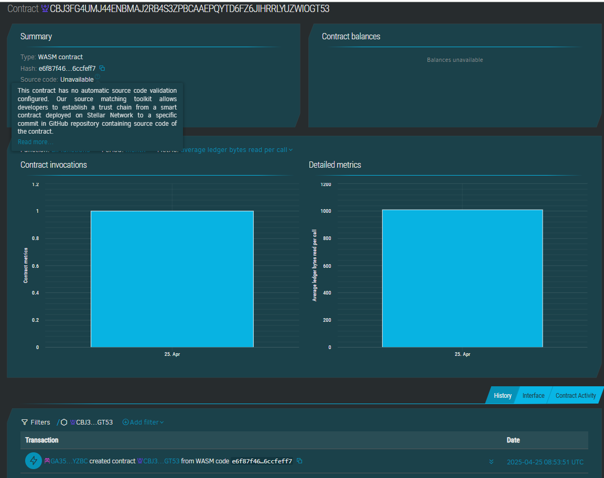

# Project Title: Homeless Shelter Locator App

## Project Description

This smart contract is a basic component for the Homeless Shelter Locator App. It allows for the storage and retrieval of the project's title and a brief description. This is a foundational element that can be extended with more complex logic in other smart contracts or off-chain components to build the full application.

## Project Vision

The vision for the Homeless Shelter Locator App is to create a decentralized and transparent platform that connects individuals experiencing homelessness with available shelter resources. This application aims to provide real-time information on shelter availability, locations, and services, empowering those in need to find safe and accessible accommodation.

## Key Features

This initial smart contract provides the following key features:

* **Set Project Details:** Allows an administrator (through contract invocation) to set the title and description of the project.
* **Get Project Title:** Enables anyone to query the contract and retrieve the current project title.
* **Get Project Description:** Enables anyone to query the contract and retrieve the current project description.

## Future Scope

While this smart contract is basic, it lays the groundwork for more advanced features in the future, which could include:

* **Shelter Registration:** Functionality for shelters to register their information (name, location, capacity, availability).
* **Location Tracking:** Integration with location services to find nearby shelters.
* **Availability Updates:** Mechanisms for shelters to update their current availability.
* **User Authentication:** Secure user accounts for both individuals seeking shelter and shelter administrators.
* **Reviews and Ratings:** A system for users to provide feedback on shelters.
* **Integration with other on-chain or off-chain services.**

